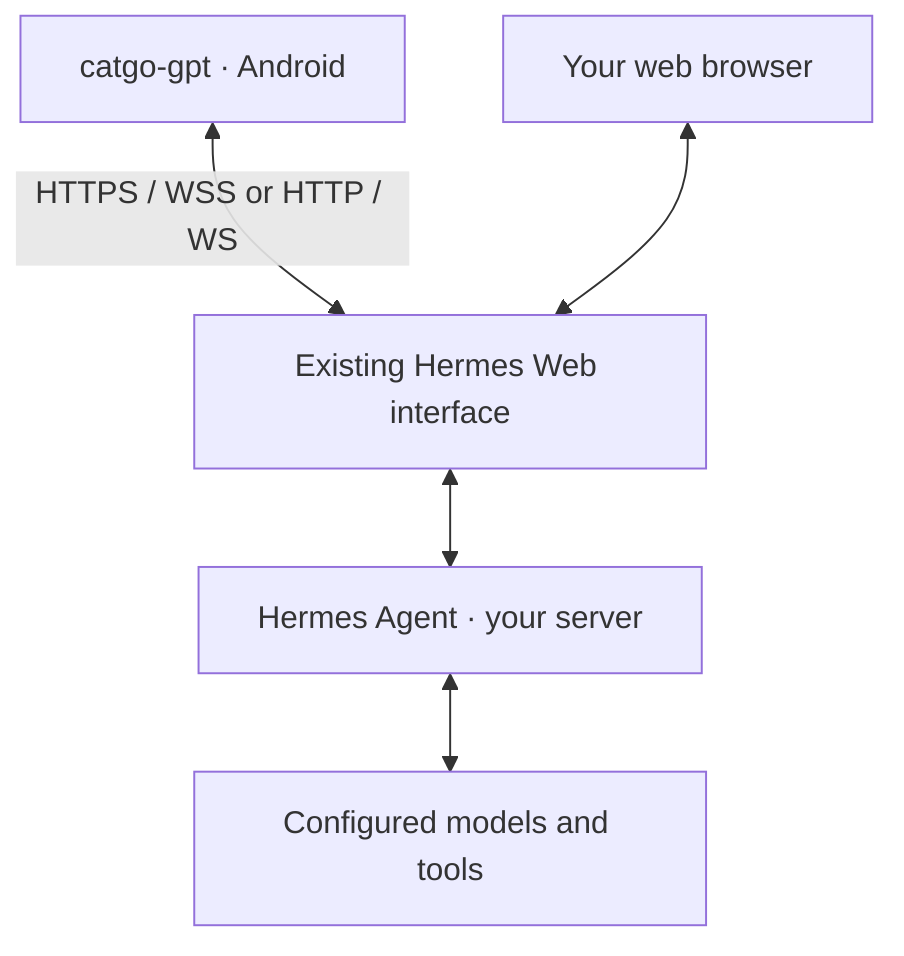
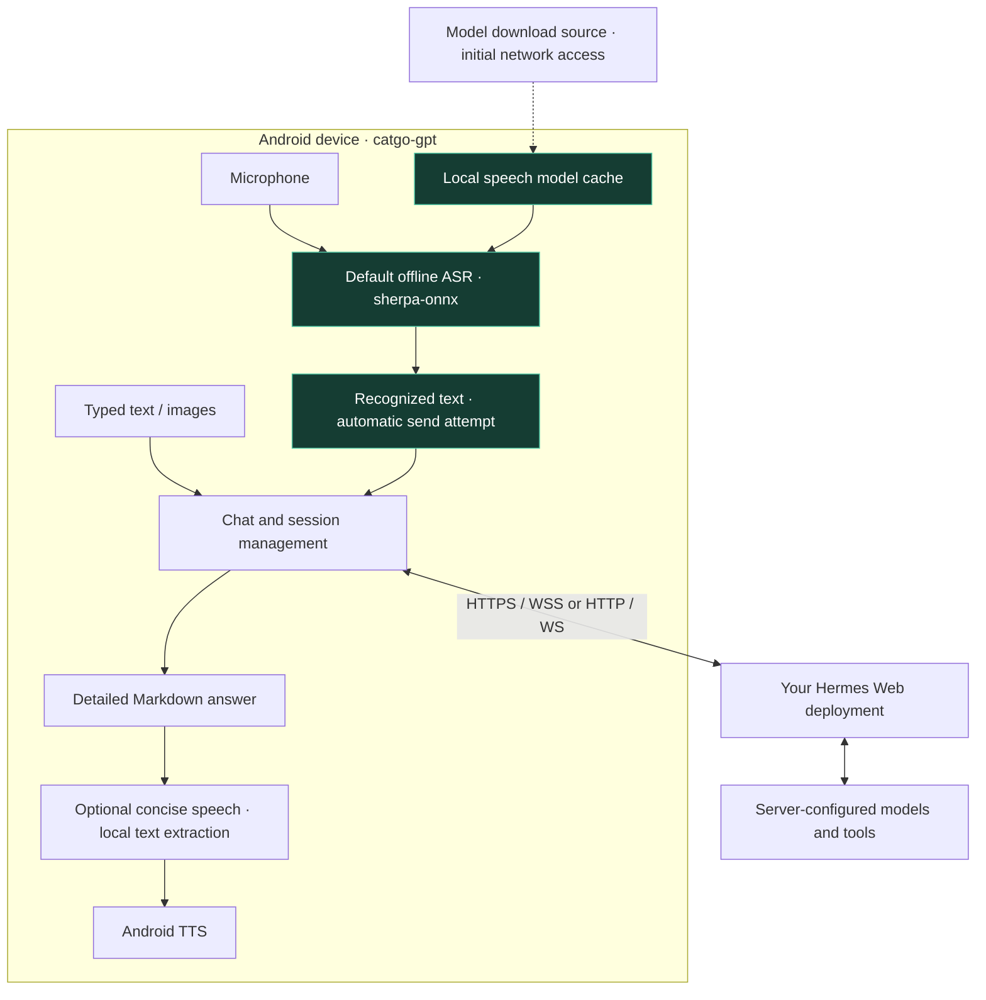

# catgo-gpt

English | [简体中文](README.zh-CN.md)

An unofficial Android client for compatible self-hosted Hermes Web deployments, built with Kotlin and Jetpack Compose.

**1.0.1 · [MIT License](LICENSE) · Offline-first voice input**

Not an official Nous Research or Hermes product; no affiliation or endorsement is implied.
Before public distribution, complete the asset, third-party and device checks in the [release checklist](docs/RELEASE_CHECKLIST.md).

## Why this app?

Messaging-platform integrations do not always fit shared household use, multiple users or different platform environments. In particular, for families using WeChat in China, I wanted a direct way to access Hermes without repeatedly configuring bot channels or messaging bridges.

catgo-gpt connects directly to an existing compatible Hermes Web deployment. Each family member can use their own Android device without installing an app-specific server plugin, proxy or bot integration: enter the Web server details and sign in.

**The app simplifies access, not server-side authorization.** Concurrent users, account permissions and conversation isolation depend on your Web deployment. A shared account does not provide separate private spaces.

## How it works with Hermes Agent



**Transparent to your existing Hermes server: no app-specific plugins, server code changes or additional integration configuration.** catgo-gpt is another client of the existing Web interface, not a new server component. It sends requests through compatible Web APIs; Hermes continues to run models and tools on the server and returns the results to the app.

First make sure Hermes Web works, then enter its address, port and login credentials in the app. Existing server setup—Web access, TLS, accounts and model/provider configuration—still needs to be in place. “No server changes” means no changes specifically required to add this client to an already working, [compatible Web deployment](docs/PROTOCOL.md), not that every Hermes version or CLI-only installation is supported.

## Use from mainland China without a device-side VPN

With an appropriately configured Hermes server, your Android device can access OpenAI GPT models (the models behind ChatGPT), Claude and other supported providers through Hermes without running a VPN or proxy on the phone. The phone connects to your Hermes Web endpoint; the server handles upstream model access, credentials and any required network routing. This is access through Hermes, not a replacement login for the official ChatGPT or Claude apps or their subscriptions.

If Hermes Web is hosted on your local network or within mainland China and is directly reachable, core chat traffic can stay between the phone and that local/domestic endpoint. **This is a deployment option, not a guarantee that every Android request stays inside the GFW.** A reachable endpoint outside mainland China still involves cross-border traffic. First-use speech model downloads currently use GitHub; explicitly selected system speech recognition and some TTS voices may also contact external services.

**Configure and test Hermes Web before using this app:** verify that the phone can reach the Web interface without a VPN, sign in, and receive answers from each intended model. Provider credentials, model availability and upstream connectivity must already work on the server. The app does not bypass network restrictions or fix an inaccessible or misconfigured Hermes deployment.

## Screenshots

Actual Compose screens rendered in a local Android test environment with demonstration messages, not design mockups or physical-device/live-service acceptance results. The app defaults to English and also supports Chinese.

| Connection settings | Chat |
| --- | --- |
|  |  |

## Architecture: offline-first voice



**Speech becomes text on your phone before it is sent to Hermes.** The default offline path does not upload microphone audio or require an installed system speech recognition service. Recognition itself works offline once the model is ready.

- **Local recognition:** the first use downloads an approximately 75 MB model, then reuses the local cache. The current configuration uses a Chinese Paraformer model; an English UI does not imply an English offline model.
- **Explicit fallback:** every voice dialog starts offline. Only tapping “Try system speech” enables the system recognizer, which may use the network. Errors never silently switch to cloud recognition.
- **Automatic text submission:** a non-empty result attempts a normal chat send, subject to connection and session checks. Sending messages/images and receiving Hermes answers still require connectivity.
- **Detailed text, concise speech:** the screen retains the full answer. Optional playback uses a locally extracted summary. Android TTS may use the network depending on its engine and voice pack; it is separate from offline recognition.

See the [architecture guide](docs/ARCHITECTURE.md) for module boundaries, the voice lifecycle and response playback diagrams.

## Features

- Dark native chat UI with text, multiple images, Markdown and code blocks.
- Configurable HTTP/HTTPS protocol, server, port, username and password; saved settings and encrypted credentials.
- Create, restore and search sessions; reconnect, stop generation and show compact activity status.
- Inline Hermes questions and options; explicit command approval and a separate masked secret field.
- Model and reasoning selection, applied to the server's default profile.
- Offline-first speech input with automatic text submission; optional concise answer playback.
- English and Chinese interface.

**The SSH debugging module has been removed.** This app focuses on Hermes chat, not a general-purpose remote terminal.

## Requirements

Android 8.0 / API 26 or newer, access to an existing **compatible Hermes Web deployment**, and valid credentials. No additional app-specific Hermes server configuration is required for such a deployment.

The bundled speech libraries target ARM64/ARMv7; offline speech is not guaranteed on x86 emulators.
Hermes CLI alone or an arbitrary OpenAI-compatible endpoint is not sufficient. Review the [protocol requirements](docs/PROTOCOL.md). No server or public test account is included.

## Quick start

1. Build a debug APK; public GitHub Releases have not been created yet.
2. On first launch, the interface is English. The server field shows `hermes-agent.nousresearch.com` as a grey **example only**, not a prefilled address or automatic connection target. Enter your accessible server, port (default `443`), username and password.
3. Choose HTTPS (default, port 443) or explicitly select HTTP (default port 80), then enter the final server address. Custom ports are retained when switching protocols. If you paste a full URL, its scheme must match the selection. Redirects, embedded credentials and query parameters are not supported. HTTPS servers should provide a complete certificate chain.
4. First-use offline speech downloads approximately 75 MB of model data. Subsequent recognition runs locally; explicitly selected system recognition may use the network.

**HTTP / WS is unencrypted:** passwords, session tokens and chats can be intercepted or modified. Use only on a trusted network. The selected protocol is saved for reconnect; existing configurations remain HTTPS. HTTPS never automatically falls back to HTTP. Login failures remain visible on the connection screen, and pending connections can be cancelled. Version 1.0.1 prevents delayed startup requests from closing server settings. Servers that require Secure cookies may not support HTTP login; use HTTPS rather than weakening cookie security.

Saved servers and explicit language choices take precedence over defaults. Upgrading clears retired SSH settings and credentials, but preserves chat server settings and login information. Do not uninstall to upgrade if you want to retain local settings.

## Build and test

Use JDK 17, Android SDK 36 and build-tools 36.0.0. Configure `JAVA_HOME` and `ANDROID_HOME` for your environment.

```sh
python3 scripts/check_repository.py
./gradlew :app:testDebugUnitTest :app:assembleDebug :app:lintDebug
```

Debug APK: `app/build/outputs/apk/debug/app-debug.apk`. On Windows, use `gradlew.bat`.
For a release build, run `./gradlew :app:assembleRelease`; its output is unsigned by default. Production signing keys are not included.

Initial dependency resolution needs network access. The repository includes an approximately 55 MB speech AAR.
See the [development guide](docs/DEVELOPMENT.md) for setup, test coverage, opt-in live tests and device acceptance.

## Privacy and limitations

Messages and images go to your configured server; its operators control model providers and retention policies.
Credentials are encrypted using Android Keystore. System backup is disabled; certificate and hostname validation are not bypassed.
Offline recognition does not make the whole app offline.

PTY prompt parsing depends on known server layouts. Truncated, incomplete or unsupported authorization requests are never automatically approved. Compatibility with every Hermes version, device or input method is not guaranteed; automated tests do not replace device acceptance.

See [security](SECURITY.md) and the [code review](docs/REVIEW.md).

## Documentation and contributing

- [Architecture](docs/ARCHITECTURE.md) · [Protocol](docs/PROTOCOL.md) · [Development](docs/DEVELOPMENT.md)
- [Changelog](CHANGELOG.md) · [Historical versions](docs/history/README.md)
- [Contributing](CONTRIBUTING.md) · [Code of conduct](CODE_OF_CONDUCT.md)
- [Third-party notices](THIRD_PARTY_NOTICES.md) · [Release checklist](docs/RELEASE_CHECKLIST.md)

Sanitized bug reports and focused contributions are welcome. Never include passwords, cookies, tickets, conversations or signing keys in issues or pull requests. When editing either README, keep both language editions in sync.

## License

Original code and documentation are licensed under the [MIT License](LICENSE).
Copyright (c) 2026 catgo-gpt contributors.

Third-party components retain their own licenses. Rights to the supplied icon remain unconfirmed, so it is not included in the project's MIT grant. See [third-party notices](THIRD_PARTY_NOTICES.md) and the [release checklist](docs/RELEASE_CHECKLIST.md).
