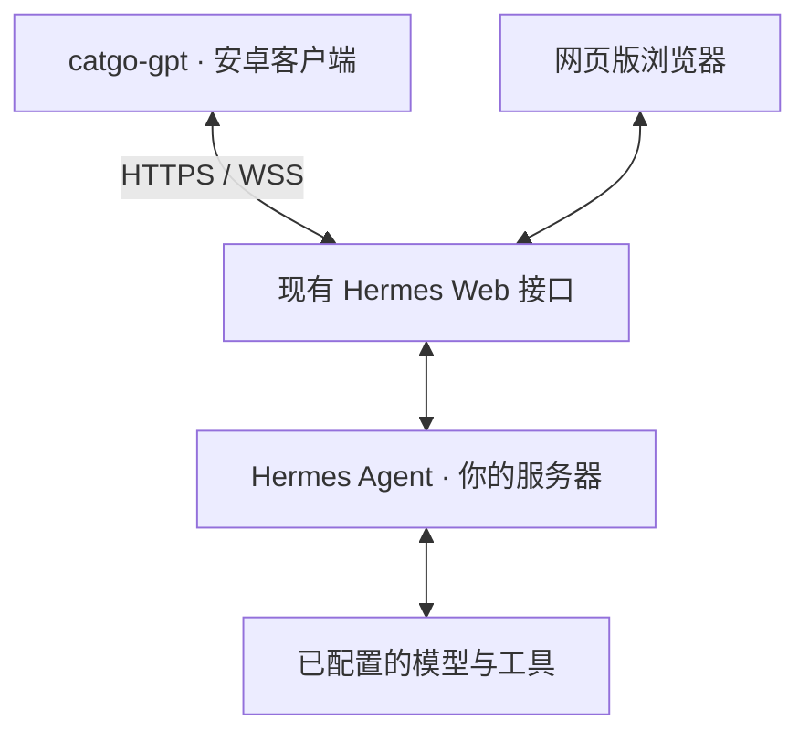
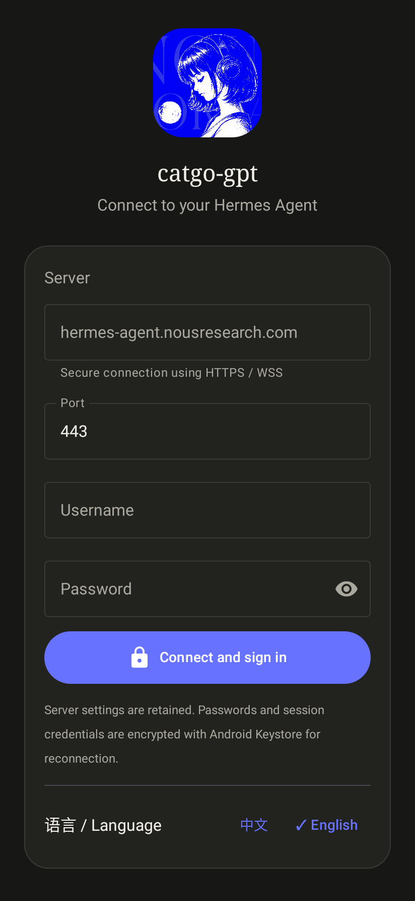
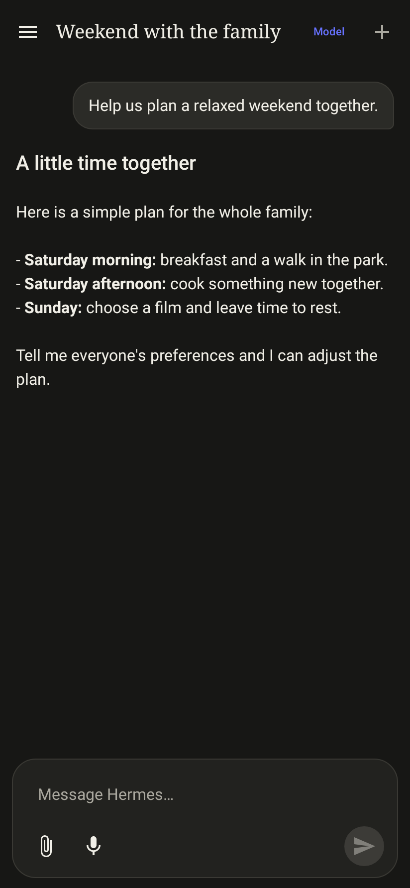
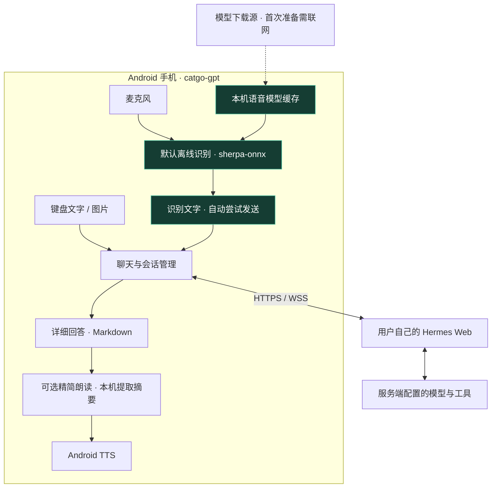

# catgo-gpt

[English](README.md) | 简体中文

面向自托管 Hermes Web 服务的非官方 Android 客户端，使用 Kotlin 与 Jetpack Compose 构建。

An unofficial native Android client for compatible self-hosted Hermes web deployments.
See [development](docs/DEVELOPMENT.md) and [backend compatibility](docs/PROTOCOL.md).

**1.0.0 · [MIT License](LICENSE) · 非官方 Android 客户端**

本项目不是 Nous Research 或 Hermes 官方产品，与其不存在官方授权或背书关系。
公开发布前仍需完成 [发布清单](docs/RELEASE_CHECKLIST.md) 中的素材、第三方分发和设备验证事项。

## 为什么做这个 App

通过各种通信软件使用 Hermes 时，机器人接入方式、账号限制和平台环境并不总能满足
多人使用、家庭内部分享等需求。尤其在中国的微信（WeChat）使用场景下，我希望家人能够
直接在手机上使用 Hermes，而不必围绕通信平台反复配置消息渠道或桥接服务。

因此写了 catgo-gpt：一个直接连接 Hermes Web 的 Android 客户端，让每位家庭成员都能
在自己的安卓设备上使用同一个已部署的 Web 服务。无需为了这个 App 额外配置 Hermes
服务端的机器人渠道、安装专用插件或部署配套代理，填写 Web 地址并登录即可开始使用。

**本 App 简化的是接入方式，不是服务端权限系统。** 多人同时使用、账号授权和聊天数据隔离，
仍取决于你的 Hermes Web 服务；请使用服务端允许的账号，不要把共享账号当作独立的隐私空间。

## 如何与 Hermes Agent 配合



**对现有 Hermes 服务端透明：无需安装任何 App 专用插件、修改服务端代码或增加接入本 App 的专用配置。** catgo-gpt 只是现有 Web 接口的另一个客户端，不是新增的服务端组件。App 通过兼容的 Web API 发起请求，Hermes 仍在服务器上调用模型、执行工具，再把结果返回给 App。

先确保 Hermes 网页版正常工作，再在 App 中填写地址、端口和登录凭据即可。服务器原有的 Web 访问、TLS、账号以及模型／供应商配置仍需准备好。“无需修改服务端”指在已有且正常工作的[兼容 Web 部署](docs/PROTOCOL.md)上接入本客户端不需要额外改造，不代表支持所有 Hermes 版本或只有 CLI 的安装方式。

## 国内直连使用：手机无需翻墙

正确配置 Hermes 服务端后，安卓设备可以通过 Hermes 使用 OpenAI GPT 系列模型（ChatGPT 背后的模型）、Claude 等受支持的模型服务，手机本身无需运行 VPN 或代理。手机连接你的 Hermes Web，由服务端负责上游模型访问、凭据和必要的网络路由。这是通过 Hermes 使用模型，不是直接登录官方 ChatGPT / Claude App，也不意味着其订阅可直接用于 Hermes。

如果 Hermes Web 部署在局域网或中国境内且手机可以直连，App 的核心聊天流量可以保持在手机与这个局域网／境内入口之间，由服务器处理上游连接。**这是可实现的部署方式，不是“安卓设备所有流量都在 GFW 内”的无条件保证。** 如果入口在境外，即使无需翻墙仍然涉及跨境流量；当前首次离线语音模型下载使用 GitHub，主动选择的系统语音识别和部分 TTS 语音也可能访问外部服务。

**请先配置并验证 Hermes 网页版，再使用本 App：** 确认手机无需 VPN 即可访问网页、登录，并让准备使用的每个模型正常回答。模型凭据、可用性和上游连通性需要在服务端提前配置好。本 App 不提供翻墙功能，也不能修复无法访问或配置不完整的 Hermes 服务端。

## 界面截图

以下截图由真实 Compose 界面在本地 Android 测试环境渲染，聊天内容为演示数据；
不是设计稿，也不是线上服务或实体手机的验收记录。默认界面语言为英文，可切换中文。

| 连接设置 | 聊天界面 |
| --- | --- |
|  |  |

## 架构概览：离线语音优先



**语音先在手机上转成文字，再发送给 Hermes。** 默认离线路径不上传麦克风音频，
不依赖手机安装系统语音识别服务；模型准备完成后，识别本身可以离线运行。

- 首次使用需联网下载约 75 MB 模型，之后复用本机缓存；当前内置配置为中文 Paraformer 模型。
- 每次打开语音窗口均默认离线模式。只有用户点击“尝试系统语音”才启用系统识别，失败不会静默切换到云端。
- 识别成功自动尝试发送文字，仍受连接状态和当前会话约束；聊天、图片发送及 Hermes 回答需要服务端连接。
- 屏幕保留详细回答，朗读使用本机规则提取的精简内容；Android TTS 是否联网取决于所选引擎与语音包，不等同于离线识别。

模块分层、语音生命周期及数据流见 [架构文档](docs/ARCHITECTURE.md)。

## 功能

- 暗色聊天界面；文字、多图输入，Markdown 与代码块显示。
- 用户配置 HTTPS 服务器、端口、用户名和密码；保存配置及加密登录凭据。
- 新建/恢复/搜索会话，断线重连、停止生成，等待区显示简洁活动状态。
- Hermes 的问题和选项直接出现在聊天中；命令执行需明确确认，密码使用独立遮罩框。
- 模型与 reasoning 选择，设置作用于服务端的 default profile。
- 语音窗口默认本机离线识别，用户点击后才尝试系统语音；识别成功自动发送。
- 可选精简朗读，屏幕仍显示详细回答；中文和英文界面。

**SSH 调试模块已完全移除。** 本项目专注于 Hermes 聊天，不再提供通用远程终端。

## 使用前提

需要 Android 8.0 / API 26 或更新版本。**只要手机能访问已有的、接口兼容的 Hermes Web 端，
并拥有可用登录凭据，就无需为本 App 再修改服务端 Hermes 配置，可直接连接使用。**
当前语音原生库打包 ARM64/ARMv7；不保证 x86 模拟器的离线语音可用。

仅有 Hermes CLI 或任意 OpenAI 兼容接口并不足够。请先核对
[服务端接口与兼容限制](docs/PROTOCOL.md)，项目没有附带服务器或公共测试账号。

## 快速开始

1. 自行构建 debug APK；公开 Releases 尚未创建。
2. 首次打开默认英文。服务器输入框以灰色显示 `hermes-agent.nousresearch.com` 作为示例；它不是已填入的地址，也不会自动连接。请填写你可访问的 Web 地址、端口（默认 `443`）、用户名和密码。
3. 使用最终 HTTPS 地址，不使用重定向入口、URL 内嵌账号或查询参数；服务端应部署完整证书链。
4. 首次离线语音需要下载约 75 MB 模型，下载后识别在本机进行。主动选择的系统语音可能联网。

用户手动选择的语言和已保存的服务器优先保留，不会被默认英文或示例地址覆盖。
升级后会清理旧 SSH 配置和加密凭据，但不会清空聊天服务器配置和登录信息。
不要卸载应用来升级，否则可能丢失本地配置。

## 构建与测试

准备 JDK 17、Android SDK 36、build-tools 36.0.0，配置自己的 `JAVA_HOME` 和 `ANDROID_HOME`。

```sh
python3 scripts/check_repository.py
./gradlew :app:testDebugUnitTest :app:assembleDebug :app:lintDebug
```

APK：`app/build/outputs/apk/debug/app-debug.apk`。Windows 使用 `gradlew.bat`。
发布构建执行 `./gradlew :app:assembleRelease`；输出默认未签名，正式签名密钥不包含在项目中。

依赖首次下载需要网络；仓库包含约 55 MB 的离线语音 AAR。
详细环境、测试范围、可选真实服务测试和真机验收见 [开发指南](docs/DEVELOPMENT.md)。

## 隐私与边界

聊天和图片发往用户配置的服务端；其模型供应商及数据保存策略由服务端决定。
凭据使用 Android Keystore 加密，应用不启用系统备份，不绕过证书或域名校验。
离线语音不等于整个应用离线运行。

PTY 提问解析依赖已知服务端布局。被截断、不完整或不支持的授权请求不会自动批准；
无法保证所有 Hermes 版本、Android 设备和输入法兼容。自动测试不能代替真实设备验收。
详见 [安全说明](SECURITY.md) 和 [代码 review](docs/REVIEW.md)。

## 文档与贡献

- [架构](docs/ARCHITECTURE.md) · [服务端协议](docs/PROTOCOL.md) · [开发与测试](docs/DEVELOPMENT.md)
- [变更记录](CHANGELOG.md) · [历史版本](docs/history/README.md)
- [贡献指南](CONTRIBUTING.md) · [社区规范](CODE_OF_CONDUCT.md)
- [第三方组件与素材](THIRD_PARTY_NOTICES.md) · [公开发布清单](docs/RELEASE_CHECKLIST.md)

欢迎提交脱敏的问题复现和小范围改进。不要在 Issue/PR 中上传密码、Cookie、票据、聊天记录或签名密钥。

## 许可证

项目自有代码与文档采用 [MIT 许可证](LICENSE)，Copyright (c) 2026 catgo-gpt contributors。
第三方组件遵循各自许可证；所提供图标的权利尚待确认，暂不纳入项目 MIT 授权范围。
详见 [第三方说明](THIRD_PARTY_NOTICES.md) 与 [发布清单](docs/RELEASE_CHECKLIST.md)。
