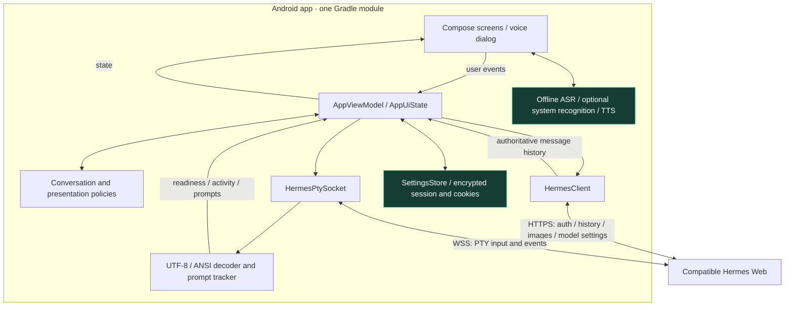
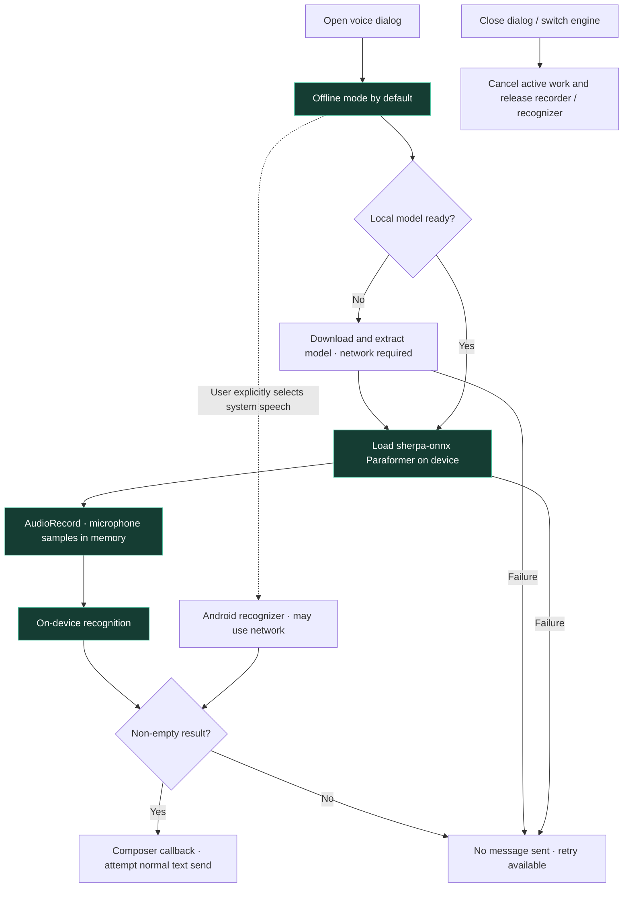
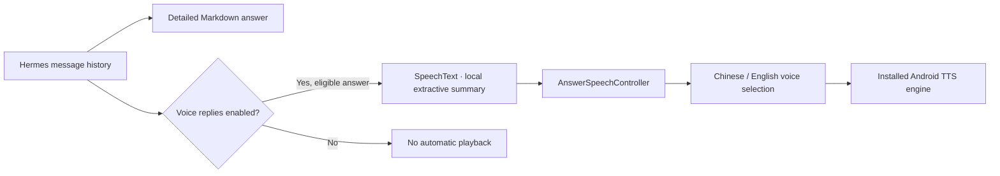

# Architecture

catgo-gpt is a single Android application module using Kotlin and Jetpack Compose.

These are logical responsibilities, not separate Gradle modules or independently deployed services.
The app connects directly to an existing compatible Web deployment; it does not require an app-specific proxy.

## Boundaries

- `ui/`: Compose views, ViewModel, presentation policies, voice input and TTS lifecycle.
- `network/`: HTTP/WebSocket transport, incremental UTF-8/ANSI processing, prompt parsing and input leases.
- `model/`: protocol data classes and server/model configuration.
- `data/`: preferences, encrypted state, upgrade cleanup.
- `i18n/` and `res/values*`: English/Chinese application text. Server content is not translated.

HTTP message history is the authoritative source of final messages. PTY output supplies readiness,
compact activity status and interactive prompts; it is not displayed as a general terminal.
`TerminalTextScreen` is a bounded parser for known prompt layouts, not the removed SSH terminal emulator.

Every socket callback and pending send must belong to the current conversation/socket generation.
Prompt leases also check screen revision and expiry. A successful transport send is not a server
acknowledgment, and approvals are never replayed automatically after reconnect.

Normal question replies use the chat composer; secrets use a separate field. Transient prompt exchange
history is memory-only, capped and scoped by session; it is not written back to server history.

Offline speech is the default when opening the voice dialog. System recognition is created only after
explicit selection. Closing or switching the dialog cancels recording/download work. Speech output is a
bounded extractive summary, while the on-screen response stays detailed.

## Offline-first voice input

- `VoiceInputDialog.kt` resets to offline mode each time. A system recognizer is not created until the user selects it; recognition errors do not trigger automatic fallback.
- `OfflineVoiceInput.kt` owns model preparation, recording and recognition. It uses sherpa-onnx with the configured Chinese Paraformer int8 model. English UI availability does not imply an English offline model.
- The approximately 75 MB first-use model download is separate from recognition. Installed files live in app-private `filesDir/speech-models`; missing or invalid files can require another download.
- The offline path processes microphone audio on-device and passes recognized text to the composer, not an audio upload API. Normal chat connection and session checks still apply; automatic send is not guaranteed delivery.
- Closing or switching the dialog cancels active recording/download work and releases resources. Cancellation does not retract a message already sent.

## Detailed text, concise optional speech

Summarization is bounded local text processing, not a second model request. The displayed answer is not replaced by the spoken summary.
TTS prefers available non-network voices but can use a network-dependent voice; its privacy/offline properties differ from the default speech recognizer.
Missing compatible language data produces an error rather than guaranteeing playback.

## Current limitations

`AppViewModel` still coordinates many concerns. Future refactoring should extract conversation and
reconnect orchestration behind tested interfaces, not rewrite transport and UI simultaneously.
PTY parsing is backend-version-sensitive. The tests do not replace device tests, microphone tests,
or end-to-end verification against an explicitly supported server revision.
